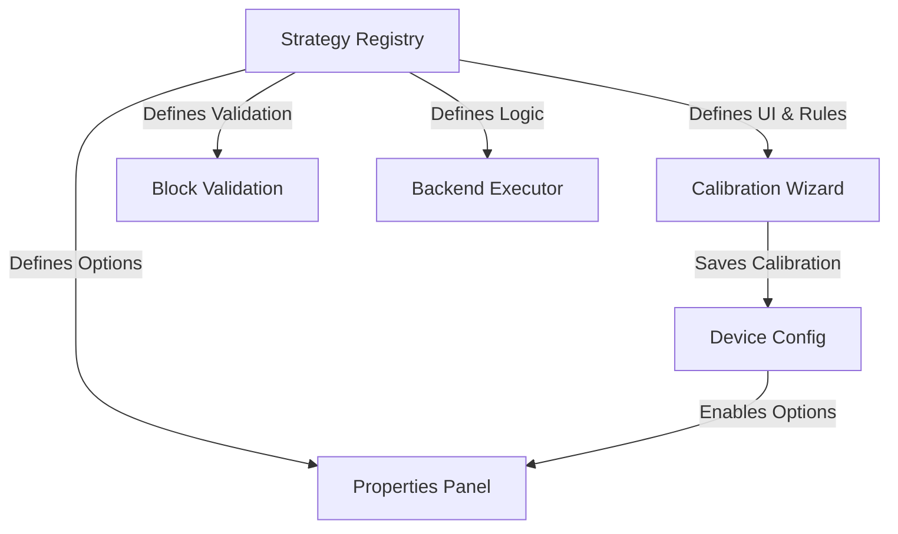

# План за Архитектурна Унификация: Strategy Registry

## 1. Цел на Промяната
Създаване на единен, централизиран механизъм ("Strategy Registry"), който управлява жизнения цикъл на "Стратегиите" – от дефиницията и калибрацията (Wizard), през избора в UI (Properties Panel), до изпълнението (Backend).

## 2. Архитектурен Поток (The Flow)



## 3. Дефиниция на Registry (`shared/strategies/StrategyRegistry.ts`)

Това е сърцето на системата.

```typescript
interface StrategyDefinition {
    id: string;               // 'tank_volume', 'pwm_linear', 'relay_hysterisis'
    label: string;            // 'Tank Volume (Liters)', 'PWM Speed Control'
    type: 'SENSOR' | 'ACTUATOR';
    
    // Units
    inputUnit: string;        // 'cm' (raw sensor), 'ml' (dosing target)
    outputUnit: string;       // 'l' (result), 'ms' (actuator duration)
    
    // Calibration Config (For Wizard)
    calibration?: {
        component: string;    // 'MultiPointTable', 'TwoPointLinear'
        minPoints: number;
        xLabel: string;
        yLabel: string;
    };
}
```

## 4. Етапи на Реализация

### Етап 1: Дефиниране на Registry
Създаване на файла и описване на текущите стратегии:
*   `linear` (Standard)
*   `tank_volume` (Multi-Point)
*   `actuator_manual` (ON/OFF)
*   `actuator_dose` (Volumetric)

### Етап 2: Интеграция с Device Wizard (Calibration)
*   **Цел:** Wizard-ът (`DynamicWizard.tsx`) да не съдържа твърдо забита логика за стъпките.
*   **Промяна:** Когато потребителят избере стратегия за калибрация, Wizard-ът пита Registry-то: *"Какъв компонент и правила да заредя?"*.
*   **Резултат:** Добавянето на нова стратегия (напр. pH Curve) става само чрез добавяне в Registry, без промяна в UI кода на Wizard-а.

### Етап 3: Унифициран Properties Panel ("Configuration")
*   **Сензори:** Поле "Reading Mode" (Read As).
*   **Актуатори:** Поле "Control Mode".
*   **Логика:**
    *   Списъкът с опции се генерира от `Device Template` (allowed strategies).
    *   Активността на опцията зависи от наличието на калибрация (проверка срещу `Device Config`).
    *   Ако липсва калибрация -> Опцията е Disabled + Tooltip "Calibrate first".

### Етап 4: Централизирана Валидация
Функция `validateBlockStrategy(block, device)`, която:
1.  Взима избраната стратегия.
2.  Пита Registry за `outputUnit`.
3.  Сравнява с променливата в блока.
4.  Връща `isValid` и `errorMsg`.

Tази функция ще замени дублираните проверки в `PropertiesPanel` и `GenericBlockNode`.

## 5. Файлове за Промяна
1.  `[NEW] shared/strategies/StrategyRegistry.ts`
2.  `frontend/src/components/devices/test/calibration/DynamicWizard.tsx` (Refactor)
3.  `frontend/src/components/editor/PropertiesPanel.tsx` (Refactor)
4.  `frontend/src/components/editor/nodes/GenericBlockNode.tsx` (Validation fix)
5.  `frontend/src/components/editor/block-definitions.ts` (Update Fields)

## 6. Какво печелим?
1.  **Consistency:** Wizard-ът и Panel-ът винаги са "на едно мнение".
2.  **Scalability:** Нови стратегии се добавят лесно.
3.  **Clean Code:** Премахваме стотици редове повтарящ се `if/else` код.
