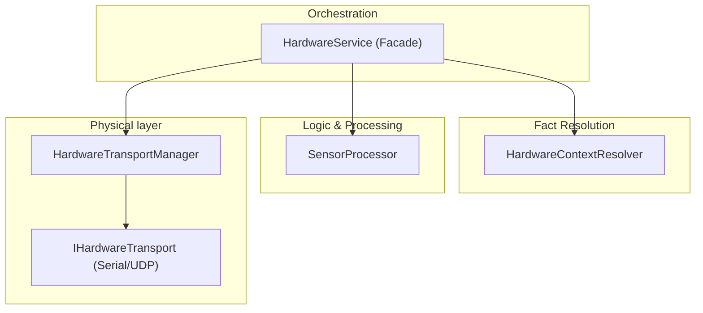

# Hardware System Architecture (v5)

Technical reference for the modular hardware management layer.

## Overview
The hardware system is organized into four specialized layers to ensure separation of concerns, stability during communication, and precise data processing.

---

## 🏗️ Core Modules

### 1. [HardwareService.ts](file:///d:/Hydroponics/Hydroponics%20v5/backend/src/modules/hardware/HardwareService.ts) (Orchestrator)
- **Role**: Entry point for all hardware operations.
- **Rules**:
    - NO physical communication logic (delegated to `TransportManager`).
    - NO mathematical conversion logic (delegated to `SensorProcessor`).
    - Orchestrates the sequence: REFRESH -> RESOLVE CONTEXT -> EXECUTE -> PROCESS.

### 2. [HardwareTransportManager.ts](file:///d:/Hydroponics/HardwareTransportManager.ts) (Communication)
- **Role**: Manages the low-level communication bridge.
- **Responsibilities**:
    - Connection Lifecycle: Instantiates and connects `SerialTransport` or `UdpTransport`.
    - Queuing: Ensures commands are sent sequentially (critical for Serial).
    - Matching: Maps incoming async responses to pending requests using command IDs.

### 3. [HardwareContextResolver.ts](file:///d:/Hydroponics/HardwareContextResolver.ts) (Facts)
- **Role**: Resolves dynamic environmental facts.
- **Responsibilities**:
    - **Hardware Facts**: Fetches ADC resolution and VRef from the Controller's `hardwareConfig`.
    - **Compensation Facts**: Resolves temperature values (Fixed, Internal, or External Sensor polling).

### 4. [SensorProcessor.ts](file:///d:/Hydroponics/SensorProcessor.ts) (Data Flow)
- **Role**: Pure logic layer for data transformation.
- **Responsibilities**:
    - **Sampling**: Median filtering of multi-sample (burst) reads.
    - **Stage 2-4 Conversions**: Normalizing hardware units and applying calibration strategies.

---

| **Stage 4** | **DISPLAY** | UI presentation scaling (e.g., mm -> inch). | `UnitRegistry` | `displayValue` (UI) |

---

## 🛰️ Status Cascading (Health Flow)

To ensure system truth, status updates flow from the physical source upwards:

1. **Controller Refresh**: Triggers a hardware `checkHealth` (Stage 1).
2. **Relay Update**: If Controller status changes, all associated Relays are updated (Stage 2).
3. **Device Update**: All Devices (direct or relay-connected) inherit the Controller/Relay status (Stage 2).

> [!NOTE]
> Refreshing a single `Device` or `Relay` automatically triggers its parent `Controller` refresh to guarantee consistent state across the whole branch.

---

## 🧪 Conversion & Strategy Governance

The system follows an "Explicit over Implicit" philosophy for sensor data processing:

### 1. Explicit Selection Required
Calibration strategies (e.g., pH, EC, Tank Volume) are **NEVER** automatically activated. After calibration, the user must explicitly set the strategy as **Active** in the UI. Until then, the system returns raw normalized data.

### 2. Role-Strategy Synchronization
To prevent data contamination, `HardwareService` enforces strict role-based isolation:
- Changing a device's `activeRole` (e.g., from generic Analog to pH) automatically clears the `activeStrategy`.
- This forces the user to choose a relevant strategy for the new role, preventing "phantom" calibration math from affecting different physical measurements.

### 3. Strategy Fallback
- If no strategy is active, `ConversionService` returns a `none` status and bypasses processing.
- If an active strategy is missing calibration data, the UI displays a pulsating **Calibration Required** warning to the user.

---

## 🛠️ Maintenance Notes (For Agent)

### Adding a New Transport:
1. Implement the `IHardwareTransport` interface in `transports/`.
2. Register the transport type in `HardwareTransportManager.getOrCreateTransport`.

### Adding a New Calibration Strategy:
1. Create the strategy in `backend/src/services/conversion/strategies/`.
2. Register it in `StrategyRegistry.ts`.
3. Ensure it consumes `context` (adcMax, voltage) from `ContextResolver`.

### Adding a New Sensor Type:
1. Create a JSON template in `backend/config/devices/`.
2. Define `rawUnit` (Stage 1 output) and `baseUnit` (Stage 2/3 target).
3. Specify `valuePath` to tell `SensorProcessor` where the value is in the wire packets.

---
> [!IMPORTANT]
> Always use `strategyOverride: "linear"` during calibration sessions to bypass Stage 3 and see the "Logical Raw" (Stage 2) value.
