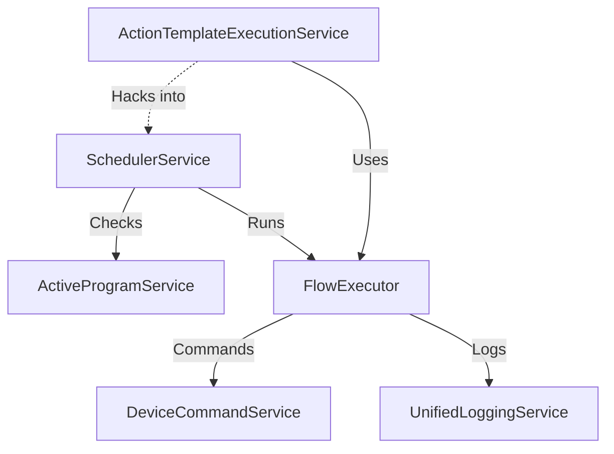

# Hydroponics v4 Deep Dive: Automation Engine

**Status**: Draft
**Domain**: Automation & Execution
**Modules**: FlowExecutor, SchedulerService, ActiveProgramService, ActionTemplateExecutionService, ActiveExecutionService

## 1. Introduction
This document provides a deep technical analysis of the "Automation Engine" in v4. This is the "brain" of the system, responsible for executing logic, managing schedules, and running tasks.

---

## 2. Module Analysis: FlowExecutor (The Core Interpreter)

### 2.1. Data Structures (Blueprint)
*Exact schemas used in the system.*

#### Flow Definition (JSON)
```typescript
interface FlowDefinition {
  id: string
  blocks: BlockDefinition[]
  connections: ConnectionDefinition[]
  metadata: {
    createdAt: Date
    updatedAt: Date
  }
}

interface BlockDefinition {
  id: string
  definitionId: string // e.g., 'sensor', 'if', 'actuator'
  parameters: Record<string, any> // Dynamic params based on type
  position: { x: number, y: number }
}

interface ConnectionDefinition {
  id: string
  sourceBlockId: string
  sourcePortId: string // e.g., 'flowOut', 'flowOutTrue'
  targetBlockId: string
  targetPortId: string // e.g., 'flowIn'
}
```

#### Execution Context
```typescript
interface ExecutionContext {
  variables: Map<string, any> // Global & Local variables
  blockStates: Map<string, any> // Loop counters, etc.
  logs: ExecutionLog[]
  errors: ExecutionError[]
}
```

### 2.2. Core Algorithms (Pseudo-Code)

#### Interpreter Loop (`executeFromBlock`)
```javascript
function executeFlow(startBlockId) {
  let currentBlockId = startBlockId;

  while (currentBlockId && !isCancelled) {
    // 1. Check Control Signals
    if (isPaused) await waitForResume();
    if (isStopped) break;

    // 2. Execute Block
    const block = getBlock(currentBlockId);
    const result = await BlockExecutor.execute(block, context);

    // 3. Handle Result
    if (!result.success) {
      handleError(result.error);
      break; // Or jump to ErrorHandler
    }

    // 4. Determine Next Block
    if (result.outputPort === 'REDIRECT') {
      currentBlockId = result.data.targetBlockId; // GOTO logic
    } else {
      const connection = findConnection(currentBlockId, result.outputPort);
      currentBlockId = connection ? connection.targetBlockId : null;
    }

    // 5. UI Delay (Legacy)
    await sleep(2000); // FIXME: Remove in v5
  }
}
```

### 2.3. Block Logic Specification
*Detailed behavior of each block type.*

| Block Type | Parameters | Logic / Behavior | Output Ports |
| :--- | :--- | :--- | :--- |
| **SENSOR** | `deviceId`, `timeout`, `monitoringTagId` | 1. Reads sensor via `StartupService` (or Hardware fallback).<br>2. Stores value in `var1` (default) or specified var.<br>3. If `monitoringTagId` is set, saves to `MonitoringData`. | `flowOut`, `onErrorOut` |
| **ACTUATOR** | `deviceId`, `actionType`, `duration` | 1. Sends command to Arduino (e.g., `RELAY_ON`).<br>2. If `duration > 0`, waits (cancellable) then sends OFF.<br>3. Updates `HardwareState`. | `flowOut`, `onErrorOut` |
| **IF** | `conditions[]` (operator, value) | 1. Compares `var1` (left) with `rightValue`.<br>2. Supports `tolerance` from DB tag.<br>3. Returns TRUE/FALSE path. | `flowOutTrue`, `flowOutFalse` |
| **LOOP** | `maxIterations`, `conditions` | 1. Increments internal counter.<br>2. Checks `maxIterations`.<br>3. Checks optional condition (WHILE logic).<br>4. If done, exits via `flowOut`. Else `loopBody`. | `loopBody`, `flowOut` |
| **WAIT** | `duration` | 1. Pauses execution for `duration` seconds.<br>2. **Crucial**: Must be cancellable (check token every 1s). | `flowOut` |
| **SET_VAR** | `variableName`, `value` | Sets a variable in the global context. | `flowOut` |
| **GOTO** | `targetBlockId` | Returns special `REDIRECT` port to jump execution. | `N/A` (Jumps) |

### 2.4. V5 Strategy (Refined)
*   **Strict Typing**: Enforce the interfaces above using Zod.
*   **State Machine**: Replace the `while` loop with an XState machine for better pause/resume handling.
*   **Removal of UI Delay**: The 2s delay in the interpreter is a hack. Remove it and use WebSocket events for UI updates.

---

## 3. Scheduler & Automation Services


---

### 2.2. SchedulerService (The Orchestrator)
*Responsible for time-based execution.*

#### 🔍 Logic & Flow
*   **Tick**: Runs every minute (`node-cron`).
*   **Priority**:
    1.  **ActiveProgram**: Checks if a cycle should start.
    2.  **Monitoring**: If no program is running, runs monitoring flows.
*   **Conflict Resolution**: "Program wins". If a program starts, monitoring pauses (or is suppressed).

#### 🔗 Dependencies
*   `ActiveProgramService`.
*   `FlowExecutor`.

#### ⚠️ Pain Points
*   **Rigidity**: Hard to run "just one quick thing" while a program is running.
*   **Cron Dependency**: `node-cron` is fine, but state persistence across restarts is tricky.

#### 🚀 V5 Strategy
*   **Decision**: **REFACTOR**.
*   **Migration**:
    *   Move to a **Priority Queue** based scheduler.
    *   Allow concurrent execution if resources (devices) don't conflict.

---

### 2.3. ActionTemplateExecutionService (The Task Runner)
*Responsible for executing parameterized templates as standalone tasks.*

#### 🔍 Logic & Flow
*   **Standalone Execution**:
    *   Loads `ActionTemplate` and its corresponding `FlowTemplate` (JSON).
    *   Creates a "Standalone" `ExecutionSession`.
    *   **Atomic Lock**: Sets `runStatus: true` on the template to prevent double execution.
    *   **Injection**: Injects `globalVariables` (params) into the flow context.
    *   **Async Execution**: Runs `FlowExecutor` without blocking the main thread.
    *   **Scheduler Integration**: Manually registers the cycle in `SchedulerService.runningCycles` so it can be paused/resumed! (This is a bit of a hack).
*   **Lifecycle**:
    *   `startActionTemplate` -> `createSession` -> `executeFlowAsync` -> `completeSession`.

#### 🔗 Dependencies
*   `FlowExecutor`.
*   `SchedulerService` (for registration hack).
*   `ActionTemplate` (Model).

#### ⚠️ Pain Points
*   **Scheduler Coupling**: The manual registration into `SchedulerService.runningCycles` is a "leaky abstraction".
*   **State Sync**: Relying on MongoDB `runStatus` for locking is slow and potential race condition source.

#### 🚀 V5 Strategy
*   **Decision**: **REFACTOR**.
*   **Migration**:
    *   Unify "Program Execution" and "Task Execution" under a single `ExecutionEngine`.
    *   Use an in-memory `JobQueue` instead of manual map manipulation.

---

### 2.4. ActiveProgramService (The Schedule Manager)
*Responsible for managing the state of the currently loaded program.*

#### 🔍 Logic & Flow
*   **State Machine**: Manages `loaded` -> `running` -> `paused` -> `stopped`.
*   **Cycle Management**:
    *   Converts static `Program` cycles into dynamic `ActiveCycles`.
    *   Calculates `nextExecution` time.
    *   **Skip Logic**: Handles manual skips (`skipCycle`) and auto-pauses if time is changed after execution.
*   **Persistence**: Saves state to MongoDB (`ActiveProgram` collection) so it survives restarts.

#### 🔗 Dependencies
*   `ActiveProgram` (Model).
*   `Program` (Model).

#### ⚠️ Pain Points
*   **Date Math**: Heavy use of `Date` objects and manual calculations.
*   **Single Tenant**: Only ONE program can be active at a time.

#### 🚀 V5 Strategy
*   **Decision**: **KEEP & IMPROVE**.
*   **Migration**:
    *   Keep the logic but clean up the Date math (use a library like `date-fns` or `luxon`).
    *   Consider allowing multiple active programs if hardware allows.

---

### 2.5. ActiveExecutionService (The Monitor)
*Responsible for tracking real-time execution status.*

#### 🔍 Logic & Flow
*   **Dashboard Data**: Aggregates data for the UI.
*   **Legacy Code**: Contains deprecated methods (`recordBlockStart`, `recordBlockComplete`) that are now largely handled by `ExecutionSession`.
*   **Logging**: Generates JSON log files for cycles (`generateCycleExecutionLog`).

#### 🔗 Dependencies
*   `ActiveExecution` (Model - Deprecated?).

#### ⚠️ Pain Points
*   **Redundancy**: Overlaps significantly with `ExecutionSession`.
*   **File Logging**: Writing JSON files to disk (`logs/execution`) is primitive.

#### 🚀 V5 Strategy
*   **Decision**: **DISCARD / MERGE**.
*   **Migration**:
    *   Merge useful logic into a `TelemetryService`.
    *   Drop the file-based logging in favor of the database or a proper time-series solution.

---

## 3. Cross-Module Dependencies Map



## 4. Conclusion & Next Steps
The Automation Engine is functional but suffers from **tight coupling** (especially between Scheduler and ActionRunner) and **mixed responsibilities** (FlowExecutor doing too much).

**Key Actions for V5:**
1.  **Decouple Interpreter**: Extract pure logic from side effects.
2.  **Unified Job Queue**: Replace the ad-hoc scheduler/runner split with a unified queue.
3.  **Clean State**: Remove the "hacky" registration of standalone tasks into the scheduler.

